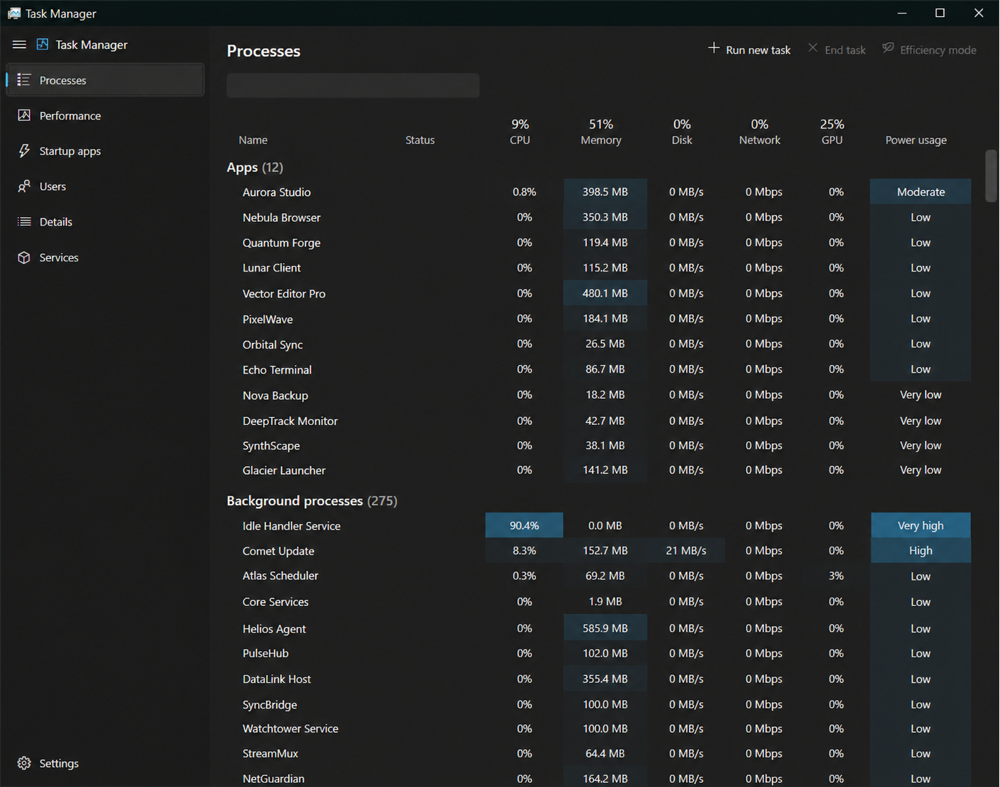
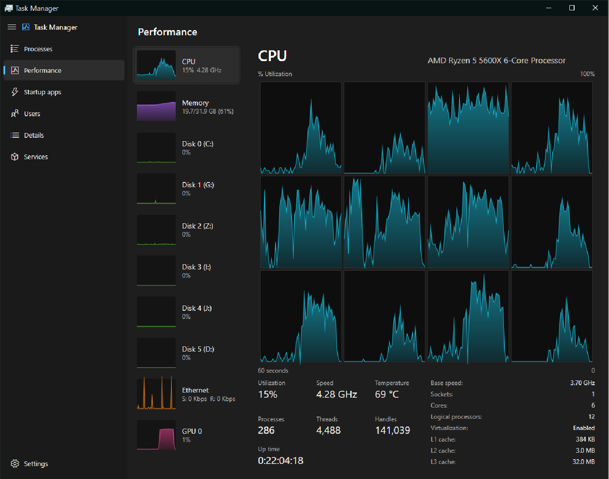
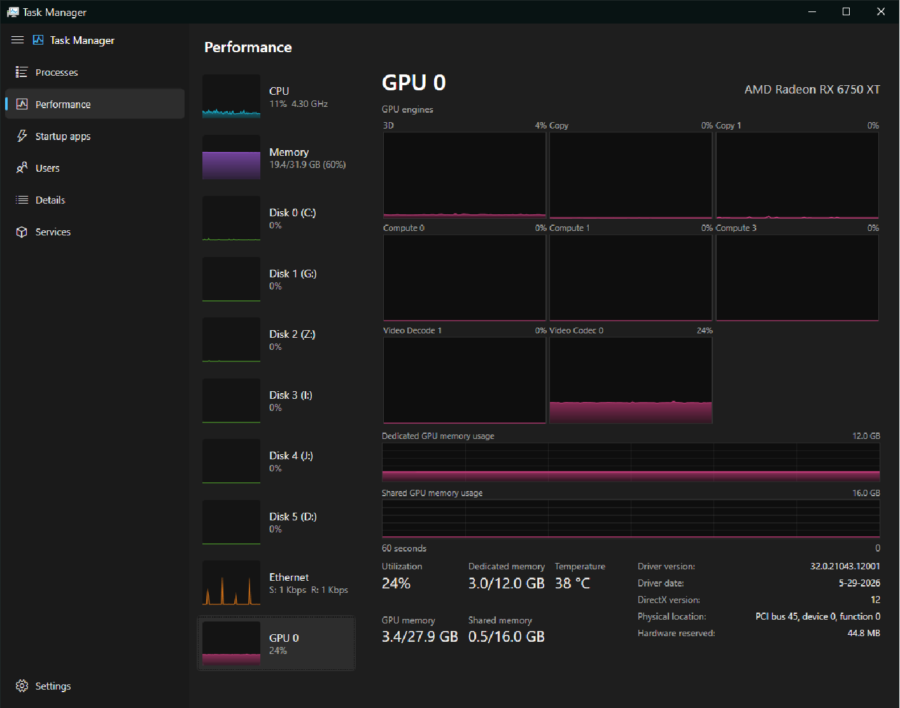

# Win11 Task Manager

A from-scratch reimplementation of the Windows 11 Task Manager, built in **WPF on .NET 8**.
It mirrors the real thing's dark Fluent look and its live Processes / Performance / Startup /
Users / Details / Services tabs, reading all of its data straight from native Windows APIs —
no WMI polling, no external agents.

> It can optionally register itself as the system Task Manager
> (see [Replacing the built-in Task Manager](#replacing-the-built-in-task-manager)).

## Screenshots

| Processes | Performance — CPU | Performance — GPU |
|:---:|:---:|:---:|
| [](img/img1.png) | [](img/img2.png) | [](img/img3.png) |

## Features

- **Processes** — live CPU / memory / disk / GPU per process, grouped into *Apps* and
  *Background processes*, with Win11-style heatmap cells, search, click-to-sort, end task,
  run new task, open file location, search online, and file properties.
- **Performance** — sparkline cards plus detailed graphs for:
  - **CPU** — overall utilization or per-logical-processor grid, live boost clock (via PDH),
    temperature (Ryzen Tctl/Tdie via LibreHardwareMonitor), process/thread/handle counts, uptime.
  - **Memory** — composition bar, committed / cached / paged & non-paged pool, installed
    speed, slots and form factor.
  - **Disk** — one card per physical drive: active time, transfer rate, response time, model,
    capacity and SSD/HDD type.
  - **Network** — throughput graph (send + receive), adapter name, link speed and IPv4/IPv6.
  - **GPU** — per-engine utilization, dedicated/shared memory, temperature, driver info
    (via PDH + the D3DKMT kernel thunks).
- **Startup apps** — entries from the `Run` keys and Startup folders, with enable/disable
  through the `StartupApproved` flags.
- **Users** — per-session CPU / memory / process-count aggregation.
- **Details** — owning user, architecture and description per process, priority control, end task.
- **Services** — enumerate, start, stop and restart Win32 services via the Service Control Manager.
- **Settings** — polling speed, default page, always-on-top, always-run-as-admin, and the
  "replace Task Manager" toggle.

## Requirements

- Windows 10/11, **64-bit** (native struct layouts are pinned to x64).
- To **run** a published build: the **[.NET 8 Desktop Runtime (x64)](https://dotnet.microsoft.com/download/dotnet/8.0/runtime?cid=getdotnetcore&os=windows&arch=x64)**
  — pick *".NET Desktop Runtime 8.0.x — Windows x64"* on that page (the plain .NET Runtime is
  not enough for a WPF app).
- To **build** from source: the [.NET 8 SDK](https://dotnet.microsoft.com/download/dotnet/8.0)
  (includes the runtime above).
- Some features require elevation (see below).

## Build & run

```sh
# from the repo root
dotnet build Win11TaskMan.csproj -c Release
dotnet run   --project Win11TaskMan.csproj -c Release
```

Or open `Win11TaskMan.slnx` in Visual Studio 2022 and press F5.

### Publish a release build

```sh
# framework-dependent x64 build (needs the .NET 8 Desktop Runtime to run)
dotnet publish Win11TaskMan.csproj -c Release -r win-x64 --self-contained false
```

The output lands in `bin/Release/net8.0-windows/win-x64/publish/` — ship the whole folder
(`Win11TaskMan.exe` plus its DLLs). It's small (~4 MB) because the .NET runtime is **not**
bundled; the target machine needs the [.NET 8 Desktop Runtime (x64)](https://dotnet.microsoft.com/download/dotnet/8.0/runtime?cid=getdotnetcore&os=windows&arch=x64)
installed.

### Elevation

The app runs unelevated, but a few capabilities need administrator rights and are best-effort
otherwise:

- CPU temperature (loads a kernel driver via LibreHardwareMonitor)
- Starting/stopping services and changing machine-wide startup entries
- Replacing the built-in Task Manager

Enable **Settings → Always run as administrator** to relaunch elevated automatically, or start
it elevated yourself.

## Project structure

The codebase is organized by responsibility; each folder maps to a `Win11TaskMan.<Folder>` namespace.

| Folder       | Namespace                | Contents                                                                 |
|--------------|--------------------------|--------------------------------------------------------------------------|
| *(root)*     | `Win11TaskMan`           | `App` and `MainWindow` — the application shell                           |
| `Views/`     | `Win11TaskMan.Views`     | The tab UserControls (Processes, Performance, Startup, Users, Details, Services, Settings) |
| `Models/`    | `Win11TaskMan.Models`    | `ProcessRow` and the value converters                                    |
| `Controls/`  | `Win11TaskMan.Controls`  | `GraphControl` — the rolling filled-area graph                           |
| `Services/`  | `Win11TaskMan.Services`  | `SystemMonitor` (the polling engine), settings, elevation, service/startup/Task-Manager-replacement logic |
| `Interop/`   | `Win11TaskMan.Interop`   | The P/Invoke layer: `NativeMethods` partials plus CPU/GPU thermal, frequency, topology and PDH counters |

### How it works

`SystemMonitor` polls native data on a background thread (process enumeration, CPU/disk/GPU/PDH
counters), computes per-tick deltas, and posts immutable snapshots to the UI thread via the
captured `SynchronizationContext` — so the render thread never blocks. Network is polled on its
own lighter timer so throughput spikes aren't lost behind a slow snapshot. The views subscribe to
those snapshots and update their grids and graphs. Nothing in `Interop` or `Services` touches WPF.

## Replacing the built-in Task Manager

**Settings → Replace Task Manager** sets the Image File Execution Options *Debugger* hook on
`taskmgr.exe` (the same mechanism Sysinternals Process Explorer uses). While enabled, anything
that launches Task Manager — Ctrl+Shift+Esc, the taskbar menu, Ctrl+Alt+Del — starts this app
instead. The toggle writes to `HKLM` and therefore requires administrator rights; turning it off
restores the original Task Manager.

## Third-party

- [LibreHardwareMonitorLib](https://github.com/LibreHardwareMonitor/LibreHardwareMonitor) — CPU
  temperature sensing.

## App icon

Drop an `AppIcon.ico` in the repo root and it's used automatically — for the executable
(Explorer / pinned shortcuts) and, at runtime, for the window and taskbar. The build works
without one (the `.exe` then just uses the default icon); no Microsoft assets are bundled.

## License

Released under the [MIT License](LICENSE) — free to use, modify and redistribute.
